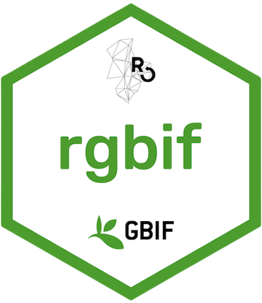
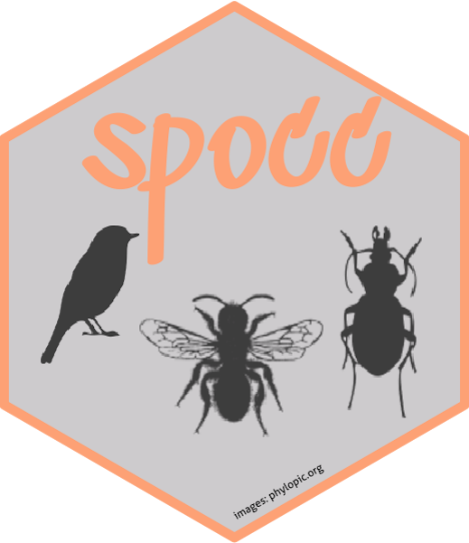
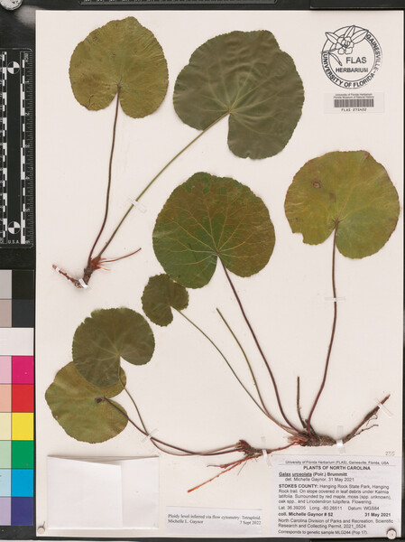
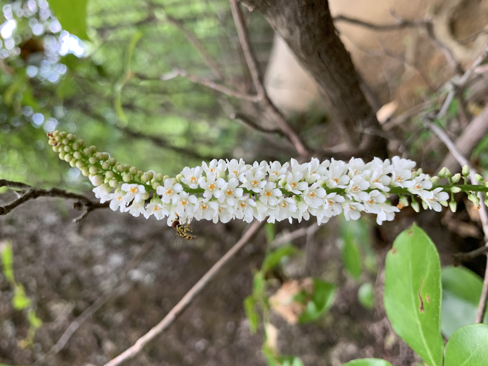
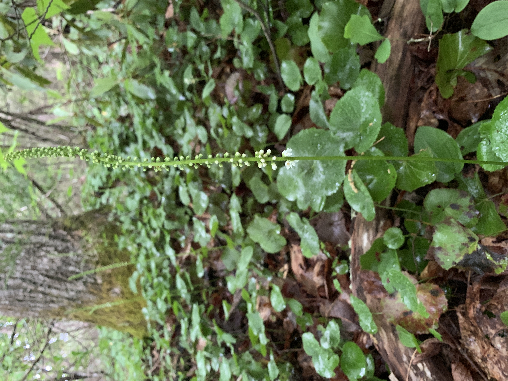
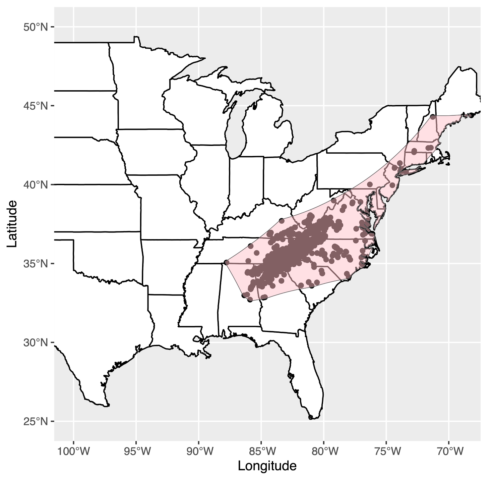
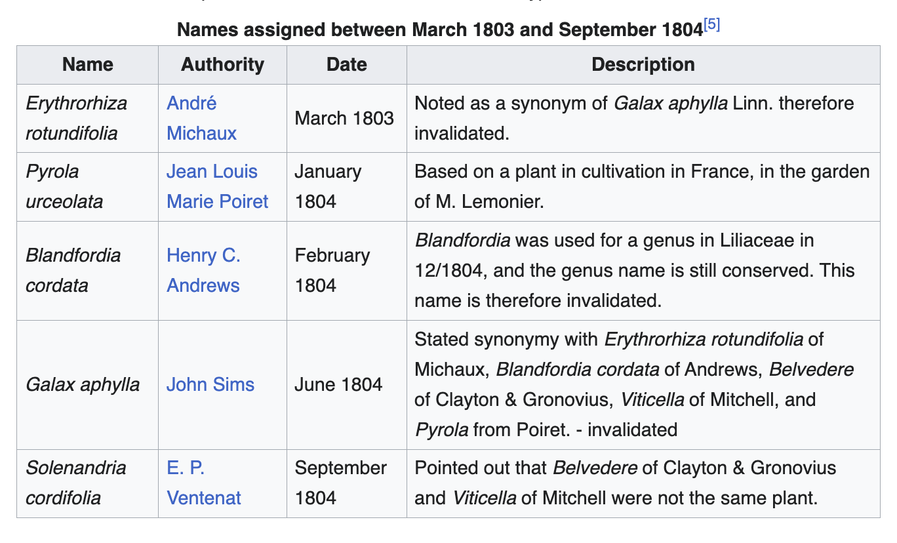
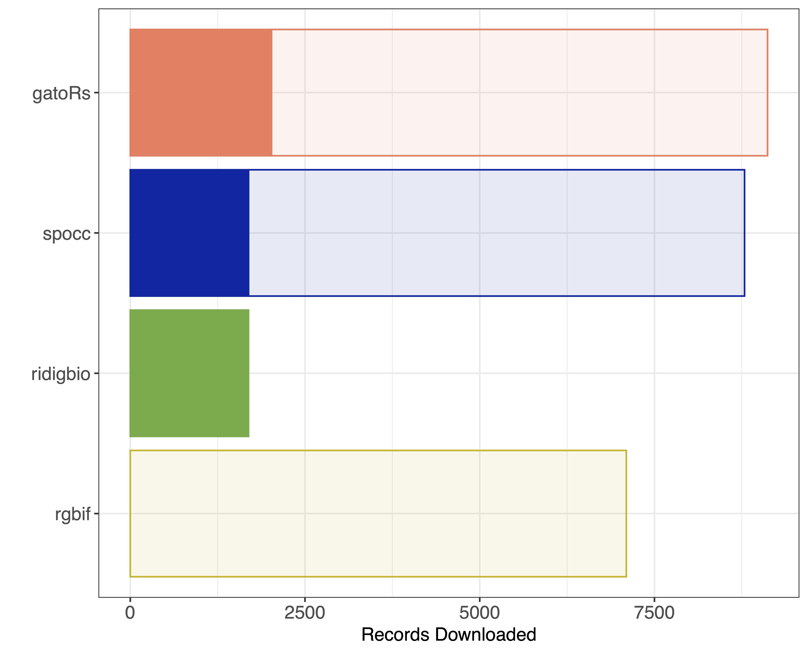

# An introduction to Geographic And Taxonomic Occurrence R-based Scrubbing (gatoRs): An R package and workflow for processing biodiversity data

Michelle L. Gaynor, Natalie N. Patten, Douglas E. Soltis, and Pamela S. Soltis

### How many digitized records exist for the Southern Appalachian endemic, Galax urceolata (Diapensiaceae)?

1.  Introduce *Galax urceolata.*
2.  Demonstrate the many ways to download occurrence records for *Galax urceolata.*
3.  Introduce gatoRs.

{width="150"} {width="150"} {width="150"} {width="150"}

## *Galax urceolata* (Diapensiaceae)

-   In the Family Diapensiaceae:
    -   *Berneuxia*, *Diapensia*, *Pyxidanthera*, *Shortia*, and *Schizocodon*.

{width="200"} {width="200"} {width="200"}

-   Southern Appalachian endemic.

{width="368"}

### Taxonomic Issues 🏴‍☠️🔥🐴

-   Identified in the 1730s by `John Clayton` and named ***Galax aphylla**.*

    -   Sent to `Jan Fredrick Gronovius` who published it as **"Anonymos or Belvedere".**

        -   All of these specimens were destroyed 🔥.

-   `John Mitchell` collected ***Nemophila aphylla*** (Boraginaceae), but mistakenly labels the specimen as ***Galax aphylla***.

    -   Specimens were stolen by pirates 🏴‍☠️ on the way to **`Linnaeus`**.

        -   `Linnaeus` accepts `John Mitchell's` description 🌪️.



Current type from `André Michaux` 🐴 labeled ***Galax aphylla***, but that name now belongs to ***Nemophila aphylla.***


-   On GBIF, there is only one specimen labeled ***Galax aphylla*** **L.** that does not belong to ***Galax urceolata*** **(Poir.) Brummitt**.

    -   Currently, all of these specimen are assigned to ***Nemophila aphylla.***

## Downloading Occurrence Records

### rgbif

```{r message=FALSE, warning=FALSE}
# Load package
library(rgbif)
```

#### Option 1: scientificName

```{r}
gbif_data <- occ_data(scientificName = c("Galax urceolata", "Galax aphylla"), 
                      limit = 8000)
nrow(gbif_data$`Galax urceolata`$data) +  nrow(gbif_data$`Galax aphylla`$data)
```

```{r}
## Now look at verbatim record
### Make sure the keys are numeric
gbif_data$`Galax urceolata`$data$key <- as.numeric(gbif_data$`Galax urceolata`$data$key)
gbif_data$`Galax aphylla`$data$key <- as.numeric(gbif_data$`Galax aphylla`$data$key)

## Download the verbatim scientificNames
query_gbif <- occ_get_verbatim(key = c(gbif_data$`Galax urceolata`$data$key,
                                       gbif_data$`Galax aphylla`$data$key) , 
                               fields = c("scientificName"))
```

```{r}
unique(query_gbif$scientificName)
```

#### Option 2: species key

```{r}
specieskey <- name_backbone(name = "Galax urceolata")
gbif_data2 <- occ_data(taxonKey = specieskey$speciesKey, 
                       limit = 8000)
```

### ridigbio

```{r}
# Load package
library(ridigbio)
```

```{r}
iDigBio_data <- rbind(idig_search_records(rq=list(scientificname="Galax urceolata")), 
                      idig_search_records(rq=list(scientificname="Galax aphylla")))
nrow(iDigBio_data)
```

```{r}
unique(iDigBio_data$scientificname)
```

### spocc

```{r}
# Load package
library(spocc)
```

```{r}
spocc_data <- spocc::occ2df(spocc::occ(query = c("Galax urceolata", "Galax aphylla"),
                                       from = c("gbif", "idigbio"), limit = 10000))
nrow(spocc_data)
```

```{r}
unique(spocc_data$name)
```

### gatoRs

```{r message=FALSE, warning=FALSE}
# Load package
library(gatoRs)
```

```{r}
gatoRs_data  <- gators_download(synonyms.list = c("Galax urceolata", "Galax aphylla"))
nrow(gatoRs_data)
```

```{r}
unique(gatoRs_data$scientificName)
```

### Take-away

{width="555"}

## Cleaning Occurrence Records

-   Taxonomic harmonization:

    -   `taxa_clean()`

-   Locality cleaning

    -   `basic_locality_clean()`

    -   `process_flagged()`

-   Remove duplicate records

    -   `remove_duplicates()`

-   Basis cleaning

    -   `basis_clean()`

-   Spatial Correction

    -   `thin_points()`

    -   `one_point_per_pixel()`

-   Downstream data processing

    -   `citation_bellow()`

    -   `remove_redacted()`

    -   `data_chomp()`

### Taxonomic harmonization

```{r}
unique(gatoRs_data$scientificName)
```

```{r}
ex <- taxa_clean(df = gatoRs_data,  
                 synonyms.list = c("Galax urceolata", "Galax aphylla"), 
                 taxa.filter = "fuzzy", 
                 accepted.name = "Galax urceolata") 
```

### Locality filtering

#### Basic Locality Clean

```{r}
gatoRs_data <- basic_locality_clean(df = gatoRs_data,  
                                    remove.zero = TRUE, # Records at (0,0) are removed
                                    precision = TRUE, # lat and long are rounded 
                                    digits = 2, # round to 2 decimal places
                                    remove.skewed = TRUE)
```

#### Quick Map

```{r message=FALSE, warning=FALSE}
# Load packages
library(ggplot2)

mapUSA <- borders("state", colour="black", fill="white")

ggplot() +
  mapUSA +
  geom_point(data = gatoRs_data, mapping = aes(x = longitude, 
                                               y = latitude, 
                                               col = factor(aggregator))) +
  coord_sf(xlim = c(-90, -68), ylim = c(25, 50)) +
  ylab("Latitude") +
  xlab("Longitude") +
  labs(col = "Aggregator")
```
